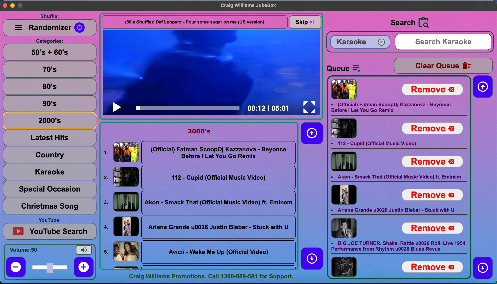
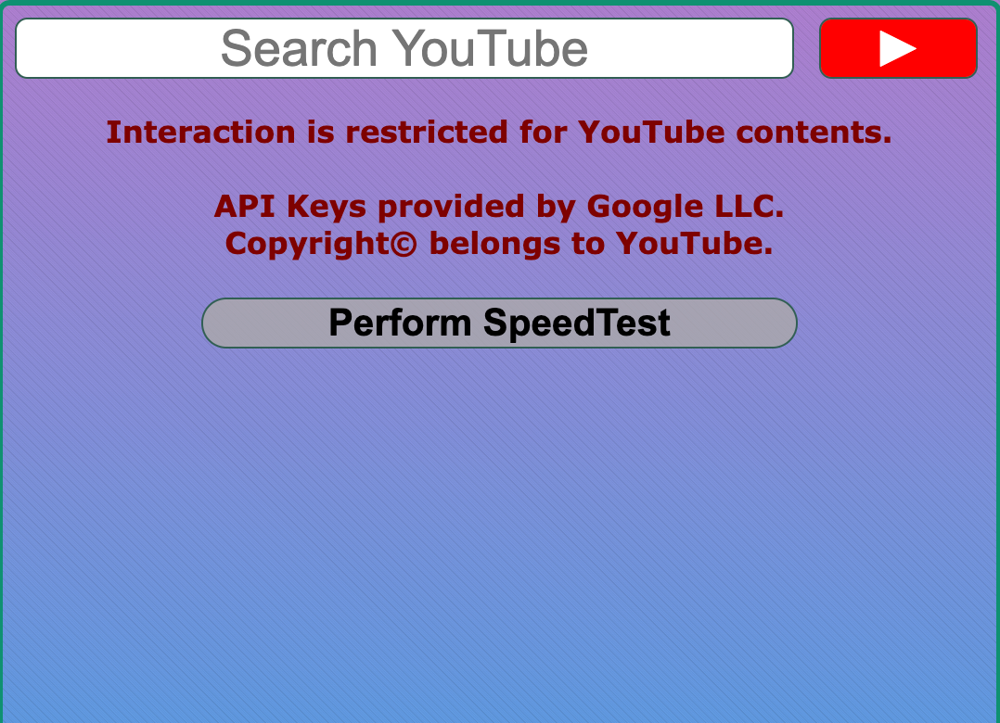
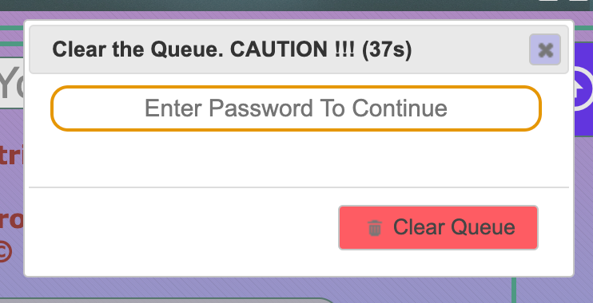
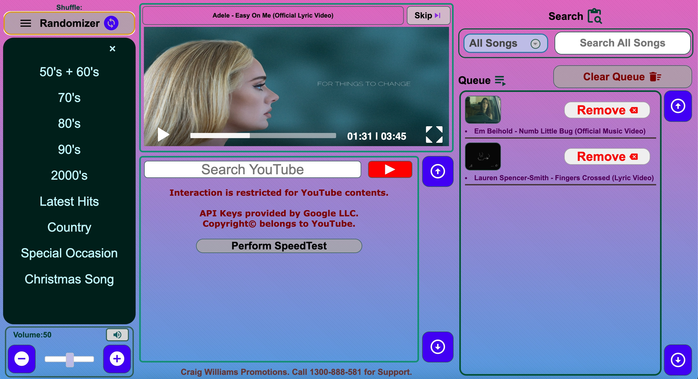
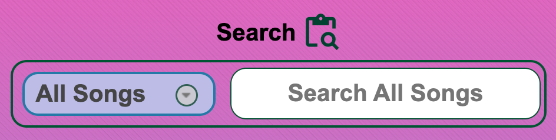

# JukeBox

A simple cross-platform jukebox video player written via NodeJS and Electron along with JavaScript, HTML and CSS. It uses libraries like jQuery, jQueryUI, mediaElementJS, Google's material icons and external Keyboard. This is rewrite
of my other project in PHP called Craig-Music-Player. The admin folder will not be included in this project so, check
the original project for that. The electron app is a standalone desktop app so it doesn't require a web server to run
and can be run on any platform.

## Features

- The application is now a standalone desktop app, thanks to Electron.
- The app caches song categories data before the program starts so it doesn't have to fetch it every time.
- The app uses a custom volume slider for system-wide volume control.

## Usage

- Clone the repository to your local machine.
- Run `npm install` in the terminal from the root folder to install all dependencies.
- Run `npm start` to start the application.
- The application window should open automatically in fullscreen.
- Use `fullscreen: true` in the main.js file to run the app in kiosk mode.

## Quirks

- Tap to make video small doesn't work for YouTube. YouTube supports only tap to play/pause.
- Zooming in too much may cause CSS to overlap. So, `resizable: false` is used in the main.js file.
- Volume slider requires multi-touch display. Use, the `+` and `-` keys for single-touch display.
- All videos are not 16/9 aspect ratio. May result in black bar.
- Config.js has not been included in the repository. It contains YT v3 API key `const YT_API_Key = "AIzaSyB9xxxxxxxxxxxxxxxxxxxxx";` needed for YouTube search.

## Demo

### Main Window

### YouTube and Speedtest

### Interactive Modals

### Shuffle Menu & Volume Slider

### Search

